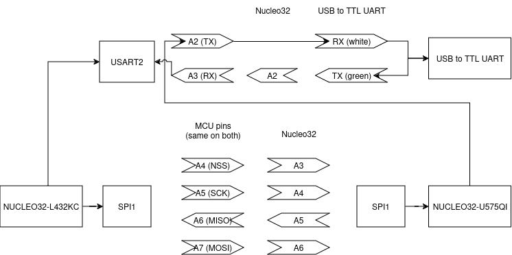

# SPI Calculator
User enters an arithmetic expression over USART2 RX to controller device (Nucleo32-L432KC), expression is sent over SPI1 MOSI to peripheral Nucleo32-U575ZI-Q. Peripheral computes the result and sends it over USART2 TX back to user.

## Pins

